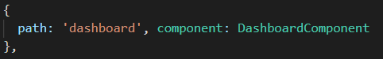
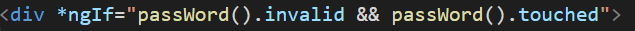

# Angular

## structure

>### `1.module`
> คือ class ที่มี @NgModule decorator ประกาศบอกไว้ เป็น class ที่รวบรวมพวก component,directive,pipes,service ที่เกี่ยวข้องเอาไว้ด้วยกัน \
> `Note : ` Angular app มี `app.module.ts` เป็น `root module` ที่เป็น module หลัก และ Angular app สามารถมีได้หลาย module 
>
> 
>
> ใน `@NgModule` decorator จะมี metadata ดังนี้
> - `declarations` => เอาไว้ define components , directives , pipes ที่ต้องการจะใช้ใน Angular app
> - `imports` => เอาไว้ import module อื่นๆเข้ามาใช้กับ Angular app
> - `providers` => เอาไว้ register service ด้วย dependency injection ที่จะเอามาใช้กับ Angular app เพื่อให้ class อื่นสามารถเรียกใช้ได้ `(ใน version ปัจจุบันไม่ต้อง inject service แล้ว)`
> - `bootstrap` => เป็นตัวเริ่มการทำงาน(`render view`)ของ `app.component.ts` (root component) ที่เป็นศูนย์รวมของ view อื่นๆภายใน Angular app `(มีแค่ root module เท่านั้นที่จะทำการ bootstrap ให้กับ root component)`
> - `export` => export class หรือ ตัวแปรให้ class อื่นๆเรียกใช้ได้

>### `2.Package.json`
> คือ ที่ๆบอกว่า Angular app เราใช้ library , module อะไรบ้าง ทุกครั้งที่เราสร้าง project Angular ขึ้นมาใหม่มันจะ install module พื้นฐานที่จำเป็นซึ่งสามารถมาดูได้ที่นี่ เช่น node_module เป็นต้น

>### `3.src folder`
> - `main.ts` => เป็น entry point ของ Angular app (app.module ถูก export มาใช้ที่นี่)
> - `index.html` => เป็น main template เป็นโครง view หลักของ Angular app `(โดย root component จะอยู่ภายใต้ index.html นี้)`
> - `app folder` => เป็น folder ของ app.module `(root module)` และ app.componet `(root component)` กับ พวก `component` , `service` อื่นๆ

>### `4.Component`
> `Note :` decorator function คือ function ที่เอาไว้ระบุ class ว่าเป็น regular class `(class ธรรมดา)` หรือ particular class `(class เฉพาะ)` ซึ่งใน decorator นี้จะมี Metadata เป็น property ข้อมูล 
>
> คือ class ที่มี `@Component` decorator ประกาศบอกไว้ ทำหน้าที่เกี่ยวกับการทำงานกับ view และแบ่งการทำงานออกเป็น 2 ส่วน คือ ส่วนการทำงานของ `view(.html)` , `logic(.ts)`
>
> 
>
> ใน `@Component` decorator จะมี metadata ดังนี้
> - `selector` => กำหนดชื่อให้กับ component ที่เราจะเอาไปใช้กับ view อื่นๆ สามารถ ประกาศได้ 3 แบบ \
> => `tag` -> `selector: 'app-test'`\
> => `class css` -> `selector: '.app-test'` \
> => `attribute` -> `selector: '[app-test]'`\ 
>
> 
> - `templateUrl` => เอาไว้อ้างอิงไฟล์ html \
> `Note :` สามารถใช้ template ที่เอาไว้อ้างอิงถึง html ได้โดยตรง โดยเขียน html ลงไปใน metadata template ได้เลย
> - `styleUrls` => เอาไว้อ้างอิงไฟล์ css \
> `Note :` สามารถใช้ styles ที่เอาไว้อ้างอิงถึง css ได้โดยตรง โดยเขียน css ลงไปใน metadata styles ได้เลย \
> `Note :` การสร้าง component จะมี option
>   - -it => inline template -> จะไม่มี html มาให้
>   - -is => inline style -> จะไม่มี css  
>   - --flat => จะไม่สร้างโฟลเดอร์
>   - --module=app => เป็นตัวบอก angular ให้ Import component ตัวนี้ให้กับ declarations ใน app.module.ts
>   - --skipTests=true -> ถ้าเป็น true จะไม่สร้าง ไฟล์ .spec (เป็นไฟล์สำหรับการ test)   

> ### `5.Service`
> คือ class ที่มี `@Injectable` decorator ประกาศบอกไว้ ที่เอาไว้จัดการเกี่ยวกับการ share data , call api , เชื่อมต่อกับ database หรือ server \
> `Note : ` `@Injectable` decorator เป็นตัวบอกว่า class นี้เป็น service และสามารถใช้ dependency injection ได้ โดยใน `@Injectable` จะมี Metadata providedIn: "root" เป็นการบอกว่าเป็น provide ในตัวเอง สามารถเรียกใช้ service นี้ได้เลย โดยไม่ต้องไป inject ใส่ใน providers ของ root module แล้ว (`ใน version เก่า ทุกครั้งที่สร้าง service จะต้อง inject ไว้ใน providers ของ root module เพื่อให้ทั้ง App รู้จักและสามารถเรียกใช้ได้`)

## Binding Data

>### `Interpolation`
> คือ การ binding data จาก `component class` (.ts) สู่ `component template` (.html) 
>
> `syntax => {{ }}`
>
> `Note : ` interpolation มีข้อจำกัดคือไม่สามารถใช้กับ attribute ที่เป็น boolean ได้

>### `Property Binding`
> คือ การ binding data ให้กับ attribute ที่เป็น boolean (`ใช้ binding กับ attribute ได้หมดไม่จำเป็นต้องเป็น boolean`)
>
> `syntax => [attribute] or bind-ชื่อของ attribute`

> ### `Class Binding`
> คือ การ binding ให้กับ class css ว่าจะใช้หรือไม่ใช้ ใช้ `Property binding` 
>
> 
>
> 
> 
> `หมายเหตุ : โดยที่ IsTextProperty เป็น boolean มีค่าเป็น true , false`
>
> `Note : ` สามารถใช้ attribute ngClass ในการทำ Class binding เพื่อ set ค่าแบบ Object ได้
>
> 
>
> 
>
> 
>
> `หมายเหตุ : โดยที่ IsTextProperty , IsTextStyle เป็น boolean มีค่าเป็น true , false`

> ### `Style Binding`
> คือ การ binding style css property ใช้ `Property binding` รับค่าเป็น string value `("''") or ('""')`
>
> 
>
> `Note : ` สามารถใช้ attribute ngStyle ในการทำ Style binding เพื่อ set ค่าแบบ Object ได้
>
> 
>
> 
>
> `หมายเหตุ : ชื่อ propery css ถ้ามี - สามารถเขียนได้ 2 แบบ`
> - camelCase => `fontStyle`
> - " " or ' ' => `"font-style"` or `'font-style'`

> ### `Event Binding`
> คือ การ binding data จาก `component template` สู่ `component class`
>
> `syntax => (ชื่อevent)="function ที่เอาไว้ handle event"`
>
> 
>
> 
> หมายเหตุ : เราสามารถดักจับ event ได้ด้วยการส่ง `$event` (parameter event handle)
>
> 
> หมายเหตุ : เราสามารถใช้ template statement แทน funtion handle event ได้ (`set property ผ่าน event binding ได้เลย`)

> ### `Template Reference Variables`
> คือ การ binding ที่อ้างอิง template element นั้น โดยที่เราสามารถเข้าถึง property ต่างๆของ template element นั้นๆ ได้เลย เรานิยมใช้ template ref กับ 
> - ng directive => ใช้อ้างอิง template element กับ ng directive ต่างๆ
> 
> - component interactive => ใช้กับ component interactive ระหว่าง parent component กับ child component เป็นต้น
> 
> - input 
> 
>
> `syntax -> #ชื่อ or ref-ชื่อ`

>### `Two Way Binding`
> คือ การ binding data ให้กับ property 2 ทางคือ
> - data(component template) เปลี่ยน ทำให้ data(component class) เปลี่ยนด้วย
> - data(component class) เปลี่ยน ทำให้ data(component template) เปลี่ยนด้วย
>
> `syntax -> ใช้ attribute [(ngModel)]`\
>=> [ ] property binding = data from class to template \
>=> ( ) event binding = data from template to class \
>=> จะรับค่าจาก template มาที่ class ผ่าน event binding แล้วอัพเดทค่าจาก class สู่ template ด้วย property binding
>
> `หมายเหตุ : เราสามารถทำ split two way binding เพื่อ handle การส่ง data จาก parent มา child ได้ advance มากขึ้น`

> ### `Getters-Setters`
> เราสามารถใช้ gettter-setter ในการจัดการค่าให้กับ property หรือ handle อะไรซักอย่าง หรือ ใช้แบบ Advance ในการส่ง data จาก Parent มา Child ได้ เช่น
>
> 
>
> 

## Ng-Directive

> ### `*nfIf`
> เป็นคำสั่ง if-else condition ที่ใช้กับ component template\
> `Note :` สามารถใช้ ng-template + template ref เข้ามาช่วยได้ แล้วก็ใน *ngIf ถ้า property ที่มาใช้เป็น condition เป็น null จะถือว่าเป็น false
>
> 
>
> 

> ### `[ngSwitch] กับ *ngSwitchCase`
> เป็นคำสั่ง switch case ที่ใช้กับ component template
>
> 

> ### `*ngFor`
> เป็นคำสั่ง for-loop ที่ใช้กับ component template
>
> 
> `หมายเหตุ :`
>    - สามารถอ้างอิง Index ของ array ได้ ด้วย `index as i` (i หรือ ชื่ออะไรก็ได้) 
>    - สามารถ check ว่าเป็น first element ได้ด้วย `first as f` (f หรือ ชื่ออะไรก็ได้) 
>    - สามารถ check ว่าเป็น last element ได้ด้วย `last as l` (l หรือ ชื่ออะไรก็ได้) 
>    - สามารถ check ว่า index เป็น odd ได้ด้วย `odd as o` (o หรือ ชื่ออะไรก็ได้) 
>   - สามารถ check ว่า index เป็น even ได้ด้วย `even as e` (e หรือ ชื่ออะไรก็ได้) 

## Component Interaction
>  จะเกี่ยวกับการรับ-ส่ง data ระหว่าง Parent component กับ Child component \
> `Note :` Parent component สามารถมี Child component ที่ทำงานอิสระต่อกัน

> ### `1. รับ-ส่ง data ระหว่าง parent กับ child`
> - `ส่ง data จาก parent ไป child` \
>   - สร้าง property ที่จะส่ง แล้วทำ property binding ให้กับ selector ของ child component เช่น `[parentData]="propertyที่จะส่ง"` ใน property binding จะเป็น attribute ที่ child ใช้อ้างอิง data ที่ถูกส่งมาจาก parent (ตั้งชื่อ attribute อะไรก็ได้ไม่จำเป็นต้อง parentData)
> 
>   - ใช้ decorator input (`@input`) ที่ child ให้กับ property ที่เราจะเอาไว้รับค่าที่ส่งมาจาก parent โดยอ้างอิงจากชื่อ attribute ที่ทำ property binding จาก parent
> 
> - `ส่ง data จาก child กลับไปให้ parent` \
>   - สร้าง event ในการส่ง data จาก child กลับไป parent (`EventEmitter`) ที่ child (define type ได้ เช่น new EventEmitter< string >() เป็นต้น)
>   - ใช้ decorator output (`@output`) ที่ child ให้กับ event ที่เราสร้าง
> 
>   - สร้าง event binding (childEvent) ที่ parent component ให้กับ selector ของ child component + สร้าง property ที่รับค่าจาก event ที่ได้จาก child \
>` หมายเหตุ :` ชื่อ Event ที่เอามาทำ event binding ไม่จำเป็นต้องชื่อ childEvent ขึ้นอยู่กับว่าเราสร้าง output event ที่ child หรืออ้างอิงมาชื่ออะไร `เช่นดังรูป`
> 
> 
> 
>` หมายเหตุ :` `message` คือ property ที่เอาไว้รับค่าจาก child ผ่าน event function `getDataFromChild` ที่เราทำ event binding และค่าที่รับจาก child จะเป็น `$event` (`event value`)
>
> `*** module ที่ต้องใช้` => import { EventEmitter } from '@angular/core';

> ### `2. ViewChild Decorator`
> โดยปกติเรารับ-ส่ง data ระหว่าง parent กับ child แบบ `one by one` โดยใช้ decorator `@input` , `@output` เข้ามาช่วย \
> "แต่ถ้าเราอยากเข้าถึง property,method ทั้งหมดที่ Public ใน child เราจะใช้ `@ViewChild` decorator ในการเข้าถึง data ทั้งหมดของ child" \
> `Note :` เราใช้ `@ViewChild` เข้าถึงเพื่อแก้ไข-เปลี่ยนแปลง data ของ child จาก parent เช่น _`การทำพวก modal`_ เป็นต้น \
> `Note :` เราสามารถใช้ template ref อ้างถึงตัว child component ได้เหมือนกัน (`ไม่ต้องไปสนใจ แต่รู้ไว้พอ`)
> 
> - `@ViewChild`('testViewChild', { `static: false` }) testViewChild: NgDirectiveComponent; `=>` ใช้ template ref
> - `@ViewChild`(NgDirectiveComponent, { `static: false` }) testViewChild: NgDirectiveComponent; `=>` ใช้ child ref \
>
> `Note :` ใน Angular เวอร์ชั่นใหม่เราต้องใส่ option static (`true,false`)
> - `false` => เราจะใช้ view child ใน ngOnInit ไม่ได้ (`มันใช้ตอนที่ไม่ต้อง initialize เสร็จ แต่ไปใช้ใน ngOnInit ที่ต้องรอ initilize เสร็จก่อน ทำให้ใช้ใน ngOnInit ไม่ได้`)
> - `true` => เราจะใช้ view child ใน ngOnInit ได้ (`ใช้ได้เมื่อมัน initialize เสร็จ อาจช้าเพราะต้องรอให้มันโหลดเสร็จก่อน`)

> ### `3. Component Interaction Using Service (Advance ไม่รู้ว่าจะเอาไปใช้กับงานรูปแบบไหน)`
> คือ การส่ง data จาก parent ไปที่ service (share data ไว้ที่ service) แล้วให้ child ที่ต้องการ data ไป subscribe data มาใช้ \
> `Note :` ไปดูวิธีการทำในโน้ต Angular.txt

## Pipes
> ใช้แปลง data เป็นรูปแบบต่างๆ ก่อนจะเอาไปแสดงที่ view จะไม่เปลี่ยแปลงค่าของ property ของ class \
> `Note :` ดูตัวอย่างที่ pipes.component.html

## Service
> เราสร้าง service เอาไว้จัดการ data ไม่ว่าจะเป็นการ share data , การเชื่อมต่อกับ database หรือ api , การจัดการข้อมูล ควรเอามาทำที่ service (`component class ควรจัดการแค่ logic ที่ควบคุม view`) 
>
> `step การทำ service` (เมื่อมีการเชื่อมต่อกับ database หรือ call api)
> -  import { HttpClientModule } from '@angular/common/http'; ใน app.module.ts เพื่อใช้ `module ที่จัดการเกี่ยวกับ Http` ของ `angular`
> - inject HttpClientModule ไว้ที่ imports ของ app.module.ts
> - import { HttpClient } from "@angular/common/http"; ใน service ที่ต้องการใช้ HttpClient
> - dependency injection HttpClient มาใช้ใน service 
> - dependency injection service ไปที่ component class ที่ต้องการใช้ \
> `Note: ` ถ้า dependency injection service มาใช้แล้ว สามารถใช้ได้กับตัว component class เองแล้วก็รวมถึง child ของมันด้วย

> ### `Http and Observables`
> เราดึง data จาก server ผ่าน service ด้วย Http request (`ส่ง Http request ไปที่ web api หรือ web service เพื่อไปดึง data จาก database แล้วส่ง Http response กลับมา`) 
>
> `หมายเหตุ :` Observable คือ Http response ที่ได้กลับมา
>
> `Step` การทำงานของ `Http,Observable` ใน `Angular`
> - `service` ส่ง `Http request` ไปที่ web api or web server เพื่อไปดึง data จาก database
> - database ส่ง `Observable` (Http response) กลับมา แปลง `Observable` ที่ได้ให้เป็นโมเดล data ที่เราต้องการนำมาใช้ใน Angular App (`cast observable ให้เป็นโมเดล data`)
> - subscribe ตัว `Observable` ที่ถูก cast ไปใช้ต่อที่ component ที่เราต้องการใช้แสดงข้อมูล จะได้เป็น data กลับมา (`subscribe ตัว Observable ที่ถูก cast ให้เป็นก้อน data`)
> - สร้าง `local property` ที่ `component class` เพื่อเก็บ data ที่ได้จากการ subscribe
>
> `Note : ` RxJs (`Reactive Extensions for Javascript`) เป็น library ที่จัดการเกี่ยวกับ Observable ใน angular (เป็น external library ที่ทำงานด้วย observable)

> ### `Fetch Data Using HTTP`
> - import HttpClientModule และ inject ใน imports ของ app.module (`เพื่อใช้ module ที่จัดการเกี่ยวกับ Http ของ angular`)
> - สร้าง `service`
> - dependency injection `HttpClient` ที่ service ที่เราจะใช้
> - สร้าง model ของ data
> - สร้าง url ที่จะใช้ยิง request 
> - สร้าง Method ที่ส่ง Http request และรับ Http response กลับมา return observable
> - dependency injection service ไปใช้ที่ component ที่ต้องการ
> - subscribe ตัว Observable ที่ได้จาก Method ของ service จะได้ data กลับมา
> - เอา data ที่ได้มาเก็บที่ local property ของ component เพื่อเอาไปใช้ binding ต่อ

> ### `HTTP Error Handling`
>  ใช้ catchError ผ่าน pipe ในการ handle exception error
>
> `Note : ` รายละเอียดเพิ่มเติมไปดูได้ที่ Angular.txt

## Routing and Navigation

> ### `Routing` 
> การกำหนด routing เพื่อให้ App สามารถ navigate ระหว่าง component ได้ \
> `Note :` ใน Angular App จะมี `app-routing.module.ts` ใช้กำหนด routing 
>
> 
> โดยจะแบ่งเป็น 2 ส่วน
> - `const routes` => จะเป็นที่เอาไว้สำหรับกำหนด route (routes ที่โดนสร้างจะถูกส่งมาที่ `RouterModule.forRoot(routes)` แล้ว export RouterModule ไปใช้)
> - `const routingComponent`=> เป็นที่เอาไว้เก็บ component ทั้งหมดที่เราต้องการให้มีการ navigate
> `หมายเหตุ :` โดยปกติทุกครั้งที่เราสร้าง component มันจะ import แบบอัตโนมัติไปไว้ใน `app.module.ts` แต่ best practice ที่ควรทำคือเอามาเก็บไว้ที่ `const routingComponent` ที่เราสร้างไว้ใน `app-routing.module.ts` เพื่อที่จะจัดการทุกอย่างที่เกี่ยวกับ route ไว้ที่เดียวกัน
>
> `1. simple route`
>
>  \
> จะมีการระบุ path กับ component ที่ต้องการ Navigate ไป
>
> `2. Route Parameters`
>
>  \
> จะมีการระบุ path พร้อมกับ parameter กับ component ที่ต้องการ Navigate ไป
>
> `3. Child Routes`
>
>  \
> จะมีการระบุ path กับ component ของตัว parent component และมีการระบุ path,component ของ child component (`การทำ child routes เพื่อต้องการเอา child component มาแปะบน parent component โดยที่ไม่เปลี่ยนหน้ายังอยู่และแสดงผลบน parent component`) \
> `Note :` router-outlet เป็น tag ที่เอาไว้นำ child component มา render แสดงที่ parent component โดยที่ไม่เปลี่ยนหน้า \
> `Note :` ในการทำ child routes จำเป็นต้องใช้ router-outlet เพื่อให้ child component สามารถถูก render แสดง บน parent component ได้
>
> `4. Redirecting Routes`
>
>  \
> เป็นการกำหนด default route เมื่อเข้า app มาครั้งแรก 
> - `path : ' '` => เข้ามาด้วย path default เมื่อเปิด app มา
> - `redirectTo: 'dashboard'` => ให้ redirect ไป path ไหน
> - `pathMatch: 'full'` => เป็น property ที่กำหนดวิธีการ map path url ว่าจะ map url แบบไหน
>   - full -> จะ redirect ไปได้ต้องเข้ามาด้วย path url แบบเต็มๆ
>   - prefix -> ไม่ว่าจะเข้ามาด้วย path url แบบไหน ถ้าใน path url นั้นมี path url prefix อยู่ก็จะ redirect ไปได้หมด \
>  
>
> `5. Wildcard Route`
>
>  เป็นการกำหนด route เมื่อไม่เจอ map path ที่เรากำหนด (`เป็นการ set เพื่อทำหน้าพวก 404 Not Found`)
>
>  
>
> `Note :` route มันทำจากบนลงล่าง เลยต้องกำหนด wildcard route ไว้ล่างสุด เพื่อให้มัน หา route path ทั้งหมดไม่เจอก่อน
>
> `Note :` path ที่กำหนดไม่ต้องใส่ / แต่ redirectTo จะใส่ / หรือไม่ใส่ก็ได้
>
> `Note :`  path ' ' (empty path) กำหนด pathMatch เป็น prefix ไม่ได้ จะทำให้เข้า path ไหนก็จะเข้ามาที่ path ' ' เสมอ เนื่องจาก path ' ' เป็น prefix path ของทุก path

> ### `Navigation` 
> `1. routerLink`
>
>  เป็นการ navigate ที่ใช้ที่ component template (`เป็นการ redirect ไปที่ path โดยตรง`)
>
>  
>
> `Note :` routerLinkActive เป็นการกำหนด css ให้กับ `routerLink` เมื่อมีการ navigate
>
> `2. การใช้ Router ในการ navigate `
>
>  `Note :` import {Router} from '@angular/router'; (`dependency injection ให้กับ component ที่เราจะใช้`)
> 
> 
> 
> การ navigate มี 4 แบบ
> - `Simple Navigation` => this.router.navigate(['ชื่อpath']) [`เป็นการ navigate ธรรมดา`]
> - `Route parameter Navigation` => this.router.navigate(['ชื่อpath',parameter ที่ต้องการส่งไป]) [`เป็นการ navigate ที่มีการส่ง parameter ไปด้วยโดยจะ map กับ route ที่ config ไว้`]
> - `Optional Route Parameters Navigation` => this.router.navigate(['ชื่อpath',{ชื่อ property: ค่าที่เราต้องการส่งกลับ}]) [`เป็นการ navigate ที่มีการส่ง property ไปให้อีก component`]
> - `Relative Navigation` => [`เป็นการ navigate ที่ทำให้มันจัดการกับการ route และ navigate ได้ flexible ไม่ฟิกตายตัวเหมือนการทำ absolute path`] 
>   - this.router.navigate(['ชื่อpath'], { relativeTo: `this.route` });
>   - this.router.navigate(['ชื่อpath', parameter ที่ต้องการส่งไป], { relativeTo: `this.route` });
>   - this.router.navigate(['ชื่อpath', {ชื่อ property: ค่าที่เราต้องการส่งกลับ}], { relativeTo: `this.route` }); \
>   `Note :` path `'../'` กับ  `'./'` เอาไว้ใช้กับ relative path
>       - `'../'` => เป็น path ที่กลับขึ้นไปที่ path ก่อนหน้า 1 ชั้น 
>       - `'./'`  => เป็น current path
>
>`Note :` `this.route` มาจาก dependency injection `private route: ActivatedRoute` \
>  ได้จาก import { ActivatedRoute } from '@angular/router';
>
>`Note :` relativeTo: `this.route` มีความหมายว่าให้อ้างอิงไปที่ path url ของ current route(ActivatedRoute) หรือก็คือ current path url นั่นแหละ
>
> `3. การใช้ ActivatedRoute ในการรับค่าจากการ navigate `
> 
> `Note : ` import { ActivatedRoute } from '@angular/router';
>
> `Note : ` import { ParamMap } from '@angular/router';
>
> ทำได้ 2 แบบ คือ
> - `snapshot` => คือการ get state ของ router ในตอนนั้น(เมื่อ initialize)เพื่อที่จะใช้ paramMap.get('param') ต่อได้ 
>
>   
>
> - `ParamMap Observable` => ถ้าเรา navigate กลับมาที่ component เดิม snapshot ไม่เวิร์ค (`มันจะทำแค่ตอนที่ initialize`) เพราะว่ามัน Initialize แค่ครั้งแรกที่ถูกสร้าง ถ้าเรา navigate กลับมาที่ component เดิมมันไม่ได้ initialize ใหม่ แต่แค่ reused component เดิม เราจึงแก้ไขโดยใช้ paramMap (`ถ้าเรา navigate แล้วส่งค่ากลับมาที่ component เดิม ใช้ paramMap`)
>
>   
>
> `Note : ` `this.route` มาจาก ActivatedRoute ที่ได้จาก dependency injection สามารถเอา dot ใช้ snapshot หรือ ใช้ ParamMap Observable ต่อได้เลย

> ### `Lazy Loading` 
> โดยปกติใน Angular App ทุกครั้งที่เปิด App มาครั้งแรกจะทำการโหลด component ทั้งหมดมาไว้ก่อน ทำให้เวลาใช้งานมันจะไม่มีการโหลด component อีก (`เป็นข้อดีของ SPA`) แต่ถ้า Project ที่เราทำมีขนาดใหญ่ มี component เยอะ จะทำให้เวลาเปิด App มาครั้งแรกจะเกิดการโหลดนาน เราแก้ปัญหาด้วยการทำ Lazy Loading โดยการรวม component ที่เกี่ยวข้องกันเป็น feature module แล้วค่อยๆโหลดทีละ feature module นี้ทีละอันตามลำดับเมื่อมีเปิดหน้าของ feature นั้น ทำให้เวลาเปิด App จะเร็วขึ้นเพราะเราไม่ต้องโหลดมาทุก component แล้ว
>
> `Note : ` option ในการสร้าง feature module เพิ่มเติม
>   - --routing => สร้าง routing-module สำหรับ feature module
>   - --route => สร้าง route ของ feature module ของเราให้อัตโนมัติที่ `app-routing.module.ts`(routing module ของ root module)
>   - --module app.module => เป็นการ import feature module ที่เราสร้างให้อัตโนมัติที่ imports ใน app.module (root module)
>
> 
>
> `Note : ` เวลาจะจัดการกับ component ที่อยู่ใน feature module ก็จัดการที่ module กับ routing module ของ feature module ที่มันอยู่

## Angular LifeCycle hooks
> constructor() => จะถูกเรียกใช้เป็นตัวแรกเมื่อ component ถูกสร้างขึ้นมา (เป็นการสร้างค่าเริ่มต้นให้ component) 
>
> เราสามารถแบ่ง lifecycle ได้เป็น 2 กลุ่ม
> - Parent Component 
>      - `ngOnChanges()` -> จะถูกเรียกเมื่อ input , output ที่ binding มีการเปลี่ยนแปลง (เอาไว้ดักค่า current,previous value ของ input,output)
>      - `ngOnInit()` -> จะถูกเรียกเมื่อ component ถูกสร้างเสร็จ(initialize component เสร็จ) -> จะถูกเรียกแค่ครั้งเดียว ไม่ถูกเรียกซ้ำจนกว่าจะมีการ initialize ครั้งใหม่
>      - `ngDoCheck()` -> จะถูกเรียกทุกครั้งเมื่อเรา focus ที่ element นั้นๆ แล้ว check ว่ามีการเปลี่ยนแปลงมั้ย (เอาไว้ดักการเปลี่ยนแปลงของ property object)
>      - `ngOnDestroy()` -> จะถูกเรียกใช้ก่อนที่ component จะถูกทำลาย (ใช้ตอนที่ unsubscribe ของ observable,event เพื่อไม่ให้ memory leak) \
> `Note :` memory leak ก็คือเกิดการใช้ ram เรื่อยๆ แบบสิ้นเปลืองไม่เกิดไม่ประโยชน์ทำให้ performance ช้า
>
> - Child Component
>   - `ngAfterContentInit()` -> จะถูกเรียกในการสร้าง view/content ครั้งแรก
>   - `ngAfterContentChecked()` -> จะถูกเรียกเพื่อ check การเปลี่ยนแปลงต่างๆของ child
>   - `ngAfterViewInit()` -> จะถูกเรียกเมื่อ child ถูกสร้างเสร็จ (initialize child component เสร็จ)
>   - `ngAfterViewChecked()` -> จะถูกเรียกเมื่อ property ที่ binding มีการเปลี่ยนแปลง (ใน child) \
> `Note :` group Child Component จะถูกเรียกหลัง ngDoCheck ทำเสร็จเสมอ  \
> `Note :` Angular LifeCycle hooks เรียงลำดับตามที่เรียงมาข้างต้น
>
> `1. ngOnChanges`
> - เอาไว้ดัก property ที่ค่าเปลี่ยน(เหมาะกับดัก input หลายๆตัว ที่สามารถ Keep track เรื่อง previouseValue,currentValue)
> - จะรับ parameter เป็น type SimpleChanges (changes: SimpleChanges) เป็น object ที่มี property ดังนี้
>    - previousValue เป็นค่าก่อนหน้าที่จะเปลี่ยน
>    - currentValue เป็นค่าปัจจุบัน
>    - firstChange เป็นสถานะ true,false ว่าเป็นการเปลี่ยนครั้งแรกใช่มั้ย?
> - สามารถ get ค่า property ของ object SimpleChanges ได้ด้วย changes['ชื่อ property ของเราที่มีการเปลี่ยนแปลง']
>
> `Note :` getters-setters เหมาะกับจัดการ input แค่ตัวเดียว แต่ถ้ามี property หลายตัวที่เราอยากดักการเปลี่ยนแปลงให้ใช้ ngOnChanges (`มันจะประหยัดเรื่องบรรทัดไม่ต้องเขียนเยอะ`) \
> `Note :` import,implement OnChanges -> import {  OnChanges } from '@angular/core';
>
> `2. ngOnInit`
> - จะถูกเรียกเมื่อ component ถูกสร้างเสร็จ(initialize component เสร็จ)
>
> `3. ngDoCheck()`
> - จะถูกเรียกเมื่อ input , output เป็น Object ที่มีการเปลี่ยนแปลงค่า property ภายใน Object ใน ngOnChanges ไม่สามารถ detect ได้เพราะมันไม่สามารถ access เข้าถึง obj ref ได้ ซึ่ง `ngDoCheck()` สามารถ detect ได้
>
> 
> `Note : `ถ้าเป็นการเปลี่ยนค่าที่เป็น obj ref ngOnChanges ไม่สามารถ detect ได้ แต่ถ้าเป็นการ instance ค่าให้ใหม่แทนการเข้าถึง ref แบบนี้ ngOnChanges จะ detect ได้ \
> `Note : ` import,implement DoCheck - > import {  DoCheck } from '@angular/core';
>
> `4. ngAfterContentInit`
> - จะถูกเรียกในการสร้าง view/content ครั้งแรก (ทำแค่ครั้งแรกที่ child ถูกสร้าง)
> - ใช้สำหรับ set value ที่เราไม่อยากให้มันเปลี่ยนแปลงอีก
> - จะถูกเรียกหลังทำ ngDoCheck และทำแค่ครั้งเดียวเท่านั้น จนกว่าจะ refresh ทั้ง page มันถึงจะถูกเรียกอีกครั้ง
>
> `5. ngAfterContentChecked`
> - จะเรียกหลัง ngDoCheck และถูกเรียกพร้อม ngAfterViewChecked เสมอ
> - จะถูกเรียกเพื่อ check การเปลี่ยนแปลงต่างๆของ child
>
> `6. ngAfterViewInit`
> - จะถูกเรียกเมื่อ child ถูกสร้างเสร็จ (initialize child component เสร็จ)
> - ทำแค่ครั้งเดียวเท่านั้น จนกว่าจะ refresh ทั้ง page มันถึงจะถูกเรียกอีกครั้ง
>
> `7. ngAfterViewChecked`
> - จะถูกเรียกเมื่อ property ที่ binding มีการเปลี่ยนแปลง (ใน child)
> - จะถูกเรียกหลัง ngAfterContentChecked เสมอ
>
> `8. ngOnDestroy`
> - เมื่อ component ถูกทำลาย เช่น ตอนซ่อนแสดง component (ถือเป็นการ destroy)
> - จะถูกเรียกใช้ก่อนที่ component จะถูกทำลาย (ใช้ตอนที่ unsubscribe ของ observable,event เพื่อไม่ให้ memory leak)
> 
> `Note : ` life cycle ของ parent มันจะ execute ก่อนของ child เราควรจะจัดการทุกอย่างใน life cycle ของ parent เป็นอันดับแรก

## Trick Typescript
> - string interpolation expression 
>
>  
>
> - ถ้าใช้ค่า null มา check ใน condition มันจะ return false

## Angular Form
> ## `1. Template Driven Forms (TDF)` 
> - ใช้ Two Way Binding (ngModel)
> - สามารถ keep track statement กับ validation
> - เหมาะกับการจัดการข้อมูลที่ไม่ได้ซับซ้อน
> - จัดการที่ html 
>
> `Note :` รายละเอียดอ่านเพิ่มเติมใน Angular Form.txt , project ตัวอย่าง templateDrivenForm (`ไม่นิยมใช้`)
>
> ## `2. Reactive Form`
> - จัดการที่ class
> - ไม่ใช้ two way binding
> - เหมาะกับจัดการ data ที่ซับซ้อน
> 
> ### **FormControl**
> คือ filed data สำหรับ Input 1 ตัว \
> `Ex.` 
>```
>   formControl = new FormControl('value');
>```
> `Note :` new FormControl(' ') เป็น default ไม่มีค่า
>
> ### **FormGroup**
> คือ group ของ FormControl \
> `Ex.` 
>```
>formGroup = new FormGroup({
>        formcon1 : new FormControl(''),
>        formcon2 : new FormControl('')
>    });
>```
> ` Note :` เราใช้ FormBuilder มาช่วยจัดการ FormGroup,FormControl,FormArray ให้เขียนได้ง่ายขึ้น
> ```
> import { FormBuilder } from '@angular/forms'; 
>
>  formGroup -> this.fb.group({})
>  formControl -> this.fb.control('')
>  formArray -> this.fb.array([])
> ```
> `Note :` form array เอาไว้จัดการพวก dynamic form เช่น สามารถเพิ่ม input form control ได้เรื่อยๆ ก็เอา form control มาเก็บไว้ใน form array 
>
> ### **Dynamic Form Control**
> - import {FormArray} from '@angular/forms'; 
> - define form array ใน form model (`ใน form array จะ contain form control`)
> - define getter ที่ เข้าถึง form array เพื่อให้ html เข้าถึงได้ง่าย(ควรใส่ type assert ว่าเป็น FormArray ให้มันด้วย)
> - สร้าง method ที่เอาไว้ add dynamic form control เข้าไปใน form array
> - สร้าง button ที่ call method ข้างบน
> - เอา form array มา show บน html
>   - binding form array => `formArrayName="ชื่อ field ของ formArray"`
>   - formArray.controls คือการ get array form control ของ form array 
>   - binding form control ใน form array ด้วย index ของ form control ใน form array => `[formControlName]="i"` (i คือ index)
>
> ## Step การทำ Reactive Form
> 1. import { ReactiveFormsModule } from '@angular/forms';
> 2. inject ใส่ imports ใน app.module
> 3. สร้าง form ใน component template (html)
> 4. สร้าง form model ที่ compoent class (.ts)
> 5. binding formGroup , formControl , formArray ใน html
> - `[formGroup]="ชื่อ formGroup"`
> - `formControlName="ชื่อ formControl"`
> - `formArrayName="ชื่อ formArray"`
> - `formGroupName="ชื่อ formGroup ที่ซ้อนอยู่ใน nested form group"`
>
> ## จัดการกับ Form Control Value
> - form.setValue(`object value ของ form ที่ต้องการเปลี่ยนแปลง`) \
> `Note : ` ต้อง set value ให้ครบทุก field
> - form.patchValue(`object value ของ form ที่ต้องการเปลี่ยนแปลง`) \
> `Note : ` set value ให้บาง field ที่เราต้องการให้เปลี่ยนแปลง
>
> 
>
> ## Validation Form
> `Note : ` import { Validators } from '@angular/forms'; 
> - สร้างเงื่อนไข validate
> ```
> ex. passWord: ['', [Validators.required,Validators.minLength(5)]] -> เงื่อนไข validate มากกว่า 1
>        
> ex. passWord: ['', Validators.required] -> เงื่อนไข validation อันเดียว
>
> Note : passWord: ['default value',validation] validation สามารถทำ multi validation ได้ เก็บเป็น array
> ```
> - จัดการ show validation กับ error message 
>   - เช็คจาก reactiveForm.get('ชื่อ filed').property
>   - ทำเป็น method get field ของ form ได้ แล้วนำมาใช้ get property อีกที
> 
> 
> 
> 
>
> ## Custom validation (`ดูตัวอย่างที่ ReactiveForm ที่ user-name-validator.ts`)
> - สร้างไฟล์ที่จัดการเกี่ยวกับ validation 
> - สร้าง function ที่จัดการ validation แล้ว export ออกไปใช้ที่ component class ที่อยากใช้ custom validation (validator function)
> - รับ parameter แค่ 1 ตัว เป็น formControl (จัดการ check validate form control แค่ form control เดียว)
> - เวลาเอาไปใช้ เอาไปใส่ไว้ใน validation array ของ formControl ที่เราต้องการจะ validate
>
> 
> 
>
> ## Cross Field Validation (`ดูตัวอย่างที่ ReactiveForm ดูที่ password-validator.ts`)
> ใช้ตอนที่ต้องการจะ compare value ของ formControl ที่อยู่ใน form Group เดียวกัน (จัดการ check validate form control มากกว่า 1 ตัว) 
>
> ทำเหมือน custom validation
> - ต่างกันตรงที่ parameter ไม่ได้รับมาเป็น form control เดี่ยวๆ แต่รับมาเป็น formGroup (`มัน ref formGroup แทนจากที่เป็น formControl`)
> - ไม่ได้ set ที่ validation array ของ form control
>    - set ให้ formGroup แทน (set ให้เป็น argument ตัวที่ 2)
>    - set validator function สำหรับ cross field ให้ property validators ใน argument ตัวที่ 2 
>
> 
> 
>
> ## Conditional Validation (`ดูตัวอย่างที่ ReactiveForm`)
> เป็น validation ที่จัดการกับเงื่อนไข validate ที่มันเฉพาะ \
> `ex.` ถ้าไม่ตื้ก check box email field จะไม่ required แต่ถ้าติ้กจะ required
>
> 
>
> ### Submitting Form Data
> - submit data คือการ post form data ไปที่ server
> - binding event (ngSubmit) ให้กับ form

## RxJs
> เป็น Library ที่เอาไว้จัดการกับ data หรือ event ที่อยู่ในรูป Observable โดยที่ Observable เป็น stream เมื่อมี data หรือ event เข้ามา จะทำงานทันที หรือ  จะสามารถแก้ไขเปลี่ยนแปลงได้เลย  ทำให้ระบบมีการตอบสนองต่อค่าที่เปลี่ยนไปทันที ซึ่งเป็นไปตาม concept reactive programming
>
>` Note : ` เอาไว้ใช้กับ asychronous program เอามาใช้แทน callback ต่างๆ ให้อยู่ในรูป Observable ทำให้
> - เขียนหรือจัดการ error ได้ง่ายและเป็น pattern เดียวกัน
> - Observable มีคุณสมบัติในการปล่อย data stream ออกมาทีละตัว ทำให้ไม่มีการ hold data ไว้ใน memory และรอให้ถึงคิวตัวเอง ทำให้ใช้ resource น้อยลง
> - code อ่านง่ายขึ้น
>
> ### `Observable`
> เป็น data ใดๆก็ได้ที่เราสนใจ (_`number,string,promise,object เป็นต้น`_) ที่เก็บอยู่ในรูป Observable เอาไว้ Observe (`stream ของ data หรือ event ใดๆ ที่มีการ emit ตลอดเวลา`) \
> `Note :` ใน Angular เอาไว้ใช้จัดการกับ response ที่ได้จาก server
> ### `Observer`
> คือคนที่สนใจ data ชุดนี้ แล้วมา subscribe Observable นั้นเพื่อนำ data ไปใช้ต่อ
>
> `Note : ` การ subscription คือการที่ subscribe Observable แล้วมี Observer เป็นตัวมารับ data
>
> จะมี 3 function ใน Observable
> - next() -> จะถูกเรียกเมื่อ Observable ปล่อย data ให้ Observer
> - error() -> จะถูกเรียกเมื่อมี error
> - complete() -> จะถูกเรียกเมื่อไม่มีการ emit data แล้ว และ Observable จะหยุดทำงานทันที
>
> จะมี 3 function ใน Observer ทำผ่าน subscribe()
> - next() -> จะถูกเรียกเมื่อ Observer รับ data จาก Observable
> - error() -> จะถูกเรียกเมื่อมี error
> - complete() -> จะถูกเรียกเมื่อไม่มีการ emit data แล้ว และ Observable จะหยุดทำงานทันที
>
> `Note : ` function ของ Observer ที่ใช้ใน subscribe() ไม่จำเป็นต้องมีครบ 3 function ก็ทำงานได้
>
> `Note : ` เมื่อเรา subscribe Observable ภายใน Observer จะมีการ call subscription และเราสามารถ cancel subscription ที่เราไม่ได้ใช้เป็นเวลานานได้
>
> `Note : ` Observable สามารถมี multi Observer ได้ คือ add(observer) และสามารถ remove(observer) ออกได้
>
> 
>
> `Note : ` Observable เป็นเพียงตัวเชื่อม(`stream`) ในการส่ง data ระหว่าง Producer(`ผู้ส่ง`) กับ Consumer(`ผู้รับ`)
>
> ### `Hot & Cold Observable`
>
> 1. Hot Observable => คือ Observable ที่ไม่ได้สนว่า Observer จะมา subscribe มันตอนไหน ซึ่ง data ที่ emit ให้แต่ละ Observer จะเป็น data ชุดเดียวกัน (`เป็นการ share source data หรือ Producer ตัวเดียวกัน`) สาเหตุที่เป็นแบบนี้เพราะว่า เมื่อเราสร้าง Hot Observable เราจะ create Producer ไว้ข้างนอก Observable แล้วค่อยเอา Producer ไปใช้ใน Observable อีกที ทำให้ไม่มีการสร้าง Producer ขึ้นมาใหม่เมื่อมีการ subscribe ส่งผลให้ Observer ที่มา subscribe แต่ละตัวจะมี source data หรือ Producer ตัวเดียวกัน
> 2. Cold Observable => คือ Observable ที่จะ emit data ก็ต่อเมื่อมี Observer ที่มา subscribe ซึ่ง data ที่ emit ให้ Observer แต่ละตัวนั้นเป็น data คนละชุดกัน เป็นข้อมูลของใครของมันในแต่ละ Observer สาเหตุที่เป็นแบบนี้เพราะว่า เมื่อเราสร้าง Cold Observable เราจะ create Producer ไว้ภายใน Observable ทำให้ทุกครั้งที่มีการ subscribe เกิดขึ้น Observable จะสร้าง Producer ขึ้นมาใหม่ ส่งผลให้ Observer ที่มา subscribe แต่ละตัวจะมี source data หรือ Producer เป็นของตัวเอง
>
> `Note :` https://coursetro.com/posts/code/148/RxJS-Observables-Tutorial---Creating-&-Subscribing-to-Observables
>
> ### `Subject`
> เป็น Observable กับ Observer ในตัวเดียวกัน มี 3 ประเภท
> 1. Behavior Subject \
> เป็น subject ที่จะ get data จาก emit ตัวล่าสุดก่อนหน้าของ Behavior Subject มาด้วย
>
> 2. Replay Subject \
> เป็น subject ที่สามารถกำหนดจำนวน emit ตัวล่าสุดที่ต้องการ get data ของ Replay Subject
>
> 3. Async Subject
> เป็น subject ที่จะ get data จาก emit ตัวสุดท้ายเท่านั้น แล้วต้อง subject.complete() (`ไม่มีการ emit data อีกแล้ว จบการทำงานของ subject`)
>
> `Note : ` https://coursetro.com/posts/code/149/RxJS-Subjects-Tutorial---Subjects,-BehaviorSubject,-ReplaySubject-&-AsyncSubject
> 
> ### `Observable Operator`
> - filter() => คือการคิวรี่หา
> - map() => คือการเลือกแต่ละตัวใน Observable pipe
> - pluck() => คือการเลือกเอาเฉพาะฟีลด์ property จาก object array
> - first() => คือตัวแรกใน Observable pipe
> - pipe() => เป็นการทำ Observable แบบ multi operator
>
> `Note : ` https://coursetro.com/posts/code/150/RxJS-Operators-Tutorial---Learn-How-to-Transform-Observables